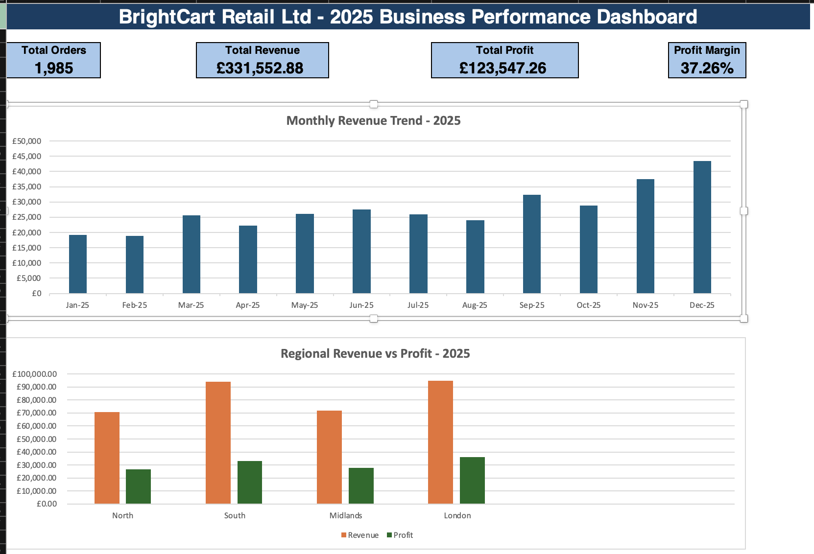
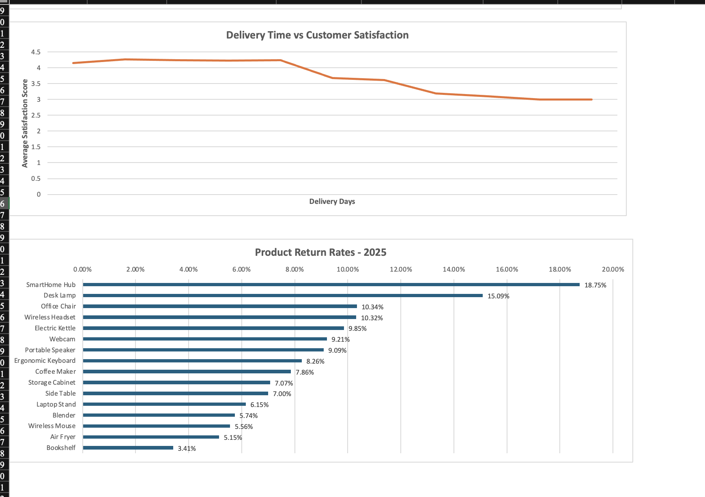

# BrightCart Retail Ltd. – 2025 Business Performance Analysis

## Project Overview

This is an independent simulated business analysis project completed using Microsoft Excel.

The project involved cleaning and analysing 2,000 retail transaction records to evaluate BrightCart Retail Ltd.'s 2025 business performance. After data cleaning and validation, 1,985 valid orders were analysed across revenue, profitability, customer segments, product performance, returns, delivery performance and customer satisfaction.

The objective was to transform raw transactional data into meaningful business insights and develop evidence-based recommendations for management.

---

## Business Problem

BrightCart Retail Ltd. needed a clearer understanding of its 2025 performance.

The analysis focused on answering questions such as:

- How much revenue and profit did the business generate?
- Which regions and products performed best?
- Which products generated strong sales but weaker profitability?
- Which areas experienced the highest return rates?
- Was delivery performance affecting customer satisfaction?
- Which areas should management prioritise for improvement?

The raw dataset also contained data-quality issues that needed to be addressed before reliable analysis could be performed.

---

## Data Cleaning

The original dataset contained 2,000 transaction records.

Data-quality issues identified included:

- 15 duplicated orders
- 24 missing customer satisfaction scores
- 6 missing customer-type values
- Inconsistent regional formatting
- Inconsistent product-category formatting
- Extra spaces within product names
- Dates stored in different formats

After cleaning and removing duplicates, the final dataset contained:

**1,985 valid orders**

Cleaning techniques included:

- `IF`
- `TRIM`
- `PROPER`
- `DATEVALUE`
- Duplicate checking
- Standardising text values
- Converting text-formatted dates
- Creating cleaned and calculated fields

---

## Key Business Metrics

| KPI | Result |
|---|---:|
| Total Orders | 1,985 |
| Total Revenue | £331,552.88 |
| Total Profit | £123,547.26 |
| Profit Margin | 37.26% |

---

## Key Findings

### Monthly Performance

December recorded the strongest monthly performance:

- Revenue: **£43,503.26**
- Profit: **£14,783.08**

February recorded the lowest monthly performance:

- Revenue: **£18,837.46**
- Profit: **£7,185.14**

The analysis showed a strong year-end performance pattern, particularly in September, November and December.

### Regional Performance

London generated the highest total revenue and profit.

The South region generated **£94,091.64** in revenue but recorded:

- Lowest regional profit margin: **35.00%**
- Highest regional return rate: **11.76%**
- Lowest regional satisfaction score: **4.07**

This indicated that strong revenue did not necessarily translate into strong overall business performance.

### Product Performance

SmartHome Hub generated the highest individual-product revenue at **£40,967.26**, but also recorded:

- Profit margin: **29.28%**
- Highest product return rate: **18.75%**
- Lowest product satisfaction score: **3.76**

This made SmartHome Hub one of the clearest areas requiring management attention.

### Delivery and Customer Satisfaction

Customer satisfaction remained relatively strong for deliveries completed within five days.

From six days onwards, satisfaction declined significantly.

Examples:

- Day 5: **4.24**
- Day 6: **3.68**
- Day 8: **3.19**
- Day 10: **3.00**
- Day 11: **3.00**

The analysis therefore identified five days as an important delivery-performance threshold.

---

## Management Recommendations

Based on the analysis, three priority actions were identified:

1. **Improve delivery performance**
   - Aim to complete deliveries within five days wherever operationally possible.

2. **Investigate high-return products**
   - Conduct root-cause analysis on SmartHome Hub and other products with high return rates.

3. **Review South regional performance**
   - Investigate pricing, discounting, delivery performance, product mix and return patterns within the South region.

---

## Excel Dashboard

A management dashboard was developed in Microsoft Excel to communicate the most important findings.

The dashboard includes:

- Total Orders
- Total Revenue
- Total Profit
- Profit Margin
- Monthly Revenue Trend
- Regional Revenue vs Profit
- Delivery Time vs Customer Satisfaction
- Product Return Rates
### Dashboard Preview

---

## Tools and Techniques

**Tool:** Microsoft Excel

Techniques used:

- Data cleaning and validation
- IF
- TRIM
- PROPER
- DATEVALUE
- SUBTOTAL
- Filtering
- Calculated columns
- Revenue, cost and profit calculations
- Profit-margin analysis
- Percentage calculations
- Average calculations
- Sorting and ranking
- KPI analysis
- Column charts
- Bar charts
- Line charts
- Dashboard development
- Business interpretation
- Evidence-based recommendation development

---

## Skills Demonstrated

- Business Analysis
- Data Cleaning
- Data Analysis
- KPI Reporting
- Financial Performance Analysis
- Customer Experience Analysis
- Operational Analysis
- Data Visualisation
- Dashboard Development
- Business Reporting
- Management Recommendations
- Microsoft Excel

---

## Project Outcome

The project demonstrated that business performance should not be evaluated using revenue alone.

The analysis showed how profitability, customer satisfaction, product returns and operational performance can provide additional insight into where a business is performing well and where management attention may be required.

---

## Disclaimer

BrightCart Retail Ltd. is a fictional organisation and this project uses a simulated dataset created for portfolio and learning purposes. The analysis does not represent the performance of a real company.
